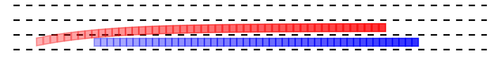
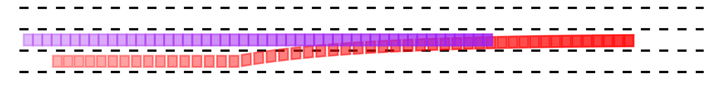
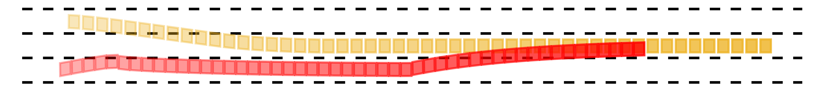

# Lane-Change-CBF
We develop a rule-based safety-critical autonomous lane change control design. The proposed method uses a finite state machine (FSM), where a quadratic program based optimization problem using control Lyapunov function and control barrier function (CLF-CBF-QP) is used to calculate the system's optimal inputs. The algorithm is validated through pre-designed typical driving scenarios and randomly generated scenarios.  
 
<center></center>

Ego vehicle changes the lane in a randomly generated scenario      

This is the reference implementation of our paper:
### Rule-Based Safety-Critical Control Design using Control Barrier Functions with Application to Autonomous Lane Change
[PDF](https://arxiv.org/pdf/2103.12382.pdf) | [Code](https://github.com/HybridRobotics/Lane-Change-CBF) | [Video](https://www.youtube.com/watch?v=icmy9u2a4z4)

*Suiyi He, Jun Zeng, Bike Zhang and Koushil Sreenath*

#### Citing
If you find this code useful in your work, please consider citing:
```shell
@article{he2021lane-change-cbf,
title={Rule-Based Safety-Critical Control Design using Control Barrier Functions with Application to Autonomous Lane Change},
author={He,Suiyi and Zeng, Jun and Zhang, Bike and Sreenath, Koushil},
booktitle={2021 American Control Conference (ACC)},
year={2021}
}
```  

#### Instructions
In our numerical simulations, the ego vehicle is expected to change to the right or left adjacent lane. Folder [core](/Lane-Change/core) contatins all relevant class and functions. 

To setup the environment, run the [`setup.m`](/Lane-Change/setup.m) firstly.

Moreover, to start different groups of simulations and show their results, folder [test](/Lane-Change/test) has:
* [`test_simulation.m`](/Lane-Change/test/test_simulation.m): Run a simulation with a pre-designed driving scenario. By changing relevant parameters, the ego vehicle will change to its left or right adjacent lane. The position, speed, acceleration of the ego vehicle and all other vehicles can be self-defined.
* [`run_random_test.m`](/Lane-Change/test/run_random_test.m): Run simulations with 100 groups of randomly generated driving scenarios. Surrounding vehicles' initial states and the time for the ego vehicle to finish lane change maneuver will be stored.
* [`playback_plot.m`](/Lane-Change/test/playback_plot.m): Show the snapshots of the ego vehicle and one surrounding vehicle during the lane change maneuver, and the ego vehicle's velocity and front steering angle history.
* [`playback_git.m`](/Lane-Change/test/playback_gif.m): Generate a gif file of the lane change maneuver and save it in the folder [gif](/Lane-Change/test/gif).

In the following cases, the ego vehicle decelerates to overtake a slow leading vehicle in the first simulation. The ego vehicle will accelerates to gain enough space to change the lane in the second simulation. In the third simulation, the ego vehicle will go back to its current lane to avoid a potential crash and change to its target lane when the threat disappears.

<div align=center>

Simulation 1



Simulation 2



Simulation 3

